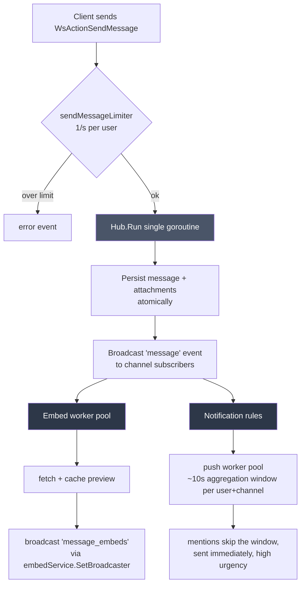

# Architecture

> Authoritative: `internal/lib/api/api.go`, `internal/service/server/hub.go`

This document covers the backend's composition root, the hub (the single
biggest and most important file in the repo), the storage layer, and the
cross-cutting pieces that don't belong to any one feature.

## Startup & lifecycle

```
cmd/discord_go/main.go
  → config.MustLoad()        (singleton, sync.Once; reads CONFIG_PATH's YAML,
                               overlays `env:`-tagged fields from the process env)
  → postgresql.New()          (opens the DB pool)
  → api.NewAPIServer(addr, db).Run(log, cfg)
```

`internal/lib/api/api.go` is the composition root. `Run` does, in order:

1. Builds the Fiber app with `Recovery → RequestID → Logger → CORS` middleware
   and mounts everything under `/api/v1`.
2. Constructs the S3 client, `push.Sender`, `embed.Service`, and `server.Hub`,
   then wires them together — see "The hub" below for why this wiring is
   two-way.
3. Registers every REST handler's routes (`user`, `notification`, `embed`,
   `webrtc`, plus the WS handler) and the admin SFU snapshot route.
4. Starts `hub.Run()` and `app.Listen` as background goroutines, then blocks
   on a `signal.NotifyContext` for SIGINT/SIGTERM.

Shutdown: on signal, `app.ShutdownWithContext` gets a 15s budget to drain
in-flight HTTP requests, then `closer.CloseAll` (`internal/lib/closer`) gets
a 10s budget to run every registered cleanup callback. Both budgets are
hardcoded in `api.go`, not configurable.

## The hub (`internal/service/server/`)

`hub.go` (~2.2k lines) is the heart of the app: every server, channel,
message, voice-participant, and SFU-session-mapping mutation goes through it.

- **`Hub.Run` is a single goroutine.** It `select`s over three channels —
  `Register` (new client), `Unregister` (client gone), `Commands` (every WS
  command from every client) — and every state mutation happens on that one
  loop. Because of this, the hub's maps (`clientsByUser`, `voiceParticipants`,
  `userVoiceChannel`, `sfuSessionByUser`, …) only need the `h.mu` mutex for
  **reads that originate off the loop** — SFU callbacks, embed-worker
  completions, push lookups. Nothing on the loop itself needs to lock.
- **`Hub.Run` must never block on I/O.** Link previews and push notifications
  both talk to the network, so instead of blocking the loop they're hosted in
  their own worker pools; the result comes back later as its own WS event
  (`message_embeds` for link previews) rather than as part of the original
  command's response.
- **One `Client` per user** (`clientsByUser`, keyed by user ID, not
  connection). A second WS connection for the same user evicts the first —
  there is no multi-tab fan-out to the same user ID. `client.go` runs a
  per-client writer goroutine that drains a 256-buffered `Outbound` channel,
  plus a WS ping every 25s (`pingPeriod`). That 25s number has to stay below
  nginx's 60s idle-connection timeout in production, or an idle voice call's
  WebSocket gets silently dropped by the proxy mid-call (see
  [`deployment.md`](deployment.md) for the nginx config that depends on this).
- **Per-action rate limiting** via `middleware.TokenBucket`, keyed by user ID:
  `create_server` and `create_channel` at 5/min (burst 5), `send_message` at
  1/s (burst 1), `mark_read` at 2/s (burst 10), `search_users` at 3/s (burst
  10, sized for an incremental type-to-search UI rather than one-shot
  searches).
- **Hub ↔ embed is wired both ways.** The hub queues a link-preview fetch job
  on `embed.Service` when a message contains a candidate URL; conversely,
  `embedService.SetBroadcaster(hub)` lets the embed worker pool push a
  finished preview back out over WS once it resolves. Neither package could
  own this relationship alone: the hub doesn't want an HTTP client on its
  loop, and the embed service doesn't own any WebSocket connections.

### Message path



Branches F and G run off `Hub.Run` entirely — they never block the loop, and
neither can hold up the ack the sender already received for their own
`send_message` command.

## Direct messages

A DM is not a separate concept at the storage/hub level: it's an ordinary
`channels` row with `server_id NULL` and `type = 'dm'`, paired with a
`dm_channels` row naming its two participants (`sql/schema/024_direct_messages.sql`).
Every mechanic that already hangs off `channel_id` — messages, attachments,
replies, mentions, unread tracking, full-text search, link previews — works
for a DM channel with zero changes; only channel *discovery* and *membership*
needed new code:

- **`CanUserAccessChannel` and `ListChannelMemberUserIDs`** (both in
  `internal/storage/postgresql/websocket.go`) each gained a `UNION ALL`
  branch reading `dm_channels` instead of `server_members` — this single
  change is what makes a DM channel get real-time delivery, typing
  indicators, edits, and access control for free, since nothing else in the
  hub distinguishes a DM channel's `channel_id` from a server channel's.
- **Visibility is per-user, not per-channel**: a `dm_visibility` row
  (`channel_id, user_id, hidden_at`) controls whether each side currently
  sees the conversation in their DM list. `OpenDMChannel` creates the row
  for the initiator only; the peer's row (and a re-reveal after either side
  closes it) is created by `RevealDMChannel`, called from `sendMessage`
  after every message saved into a DM channel — this is *also* what makes a
  closed conversation come back on a new incoming message, and how the DM
  list's ordering/last-message-time stays live, since the same call
  broadcasts `dm_opened` to both participants.
- **Pair uniqueness** (`OpenDMChannel`) is enforced by a real UNIQUE index on
  `dm_channels(user_a, user_b)` (with `user_a < user_b` normalized at the
  query layer), not just an application-level check — two concurrent
  `open_dm` calls for the same new pair race on `INSERT ... ON CONFLICT DO
  NOTHING`, and whichever loses discards the `channels` row it speculatively
  created and returns the winner's channel instead.
- **The shared-server requirement only gates creation**, never access to an
  existing DM (`ErrNoSharedServer`): once a DM channel exists, either side
  keeps access to it even if they later leave every server they had in
  common — access is membership in the DM, checked the same way as any other
  channel.
- **Invariants that must never regress** (each has a test in
  `internal/storage/postgresql/dm_test.go` or
  `internal/service/server/hub_dm_test.go`): `GetServerChannels` and
  server-scoped `SearchMessages` never return a DM channel/message;
  `DeleteChannel`'s owner-check joins `channels` to `servers`, so a DM row
  (`server_id IS NULL`) fails that join and comes back "not found" rather
  than deletable; `join_voice_channel`'s existing "channel must be
  `ChannelTypeVoice`" check rejects a DM channel with no DM-specific code
  needed, since its `Type` is `"dm"`.

See `docs/dm-plan.md` for the full design rationale and decision log.

## Storage layer

`internal/storage/postgresql/` implements the storage interfaces against
Postgres with `lib/pq` and raw SQL — there's no ORM. **The interfaces
themselves live in `types/`, not in the storage package**: `ServerStorage`,
`UserStorage`, `NotificationStorage`, `EmbedStorage`, `S3ClientStorage`, and
`PendingAttachmentStore`. Every handler and the hub depend on these
interfaces; `*postgresql.Storage` is just the one implementation that
satisfies all of them. This is why, for example, `ServerStorage.GetMessages`
takes an `s3Host` parameter — the storage layer has no config of its own and
rebuilds attachment URLs from stored S3 keys per-request using whatever host
the current request came in on.

`internal/storage/objectStorage/s3Client.go` wraps AWS SDK v2 against a
Yandex Object Storage bucket (S3-compatible). `internal/storage/cache/` (a
TTL map) and `internal/storage/single_flight/` back the link-preview cache
tiers described below.

## Link previews

A message containing a link gets an Open Graph / Twitter Card / `<title>`
preview card — but not synchronously, since `Hub.Run` can't block waiting on
an arbitrary external site.

- Fetched by `internal/service/embed/` on its own worker pool. The finished
  preview arrives as a separate `message_embeds` WS event that the frontend
  merges into the original message by `message_id`.
- Only the **first** matching link in a message gets a preview. Links back
  to the app's own frontend or its own S3 bucket are skipped (`skipHosts` in
  `api.go`, built from `frontend_base_url` and the S3 endpoint/host).
- **Three-tier cache**: in-memory (`internal/storage/cache`) → `link_previews`
  table in Postgres → network fetch. Concurrent requests for the same URL are
  collapsed via `internal/storage/single_flight`. A failed fetch is cached
  too, under a shorter, separate negative TTL, so a dead link doesn't get
  re-fetched on every message that references it.
- The `og:image` itself is **proxied**, not linked directly, through
  `GET /api/v1/embeds/image/:token` — this keeps users' IPs from leaking to
  arbitrary third-party image hosts. The token is a random 128-bit value
  stored as `link_previews.image_token`; the raw image URL is never exposed
  to the client. `image/svg+xml` responses are rejected outright.
- **SSRF is closed at the socket level**: the fetcher's `DialContext` rejects
  private, loopback, link-local (including the cloud-metadata address
  `169.254.169.254`), and CGNAT address ranges, and only allows ports 80/443.
  Because the check runs against the actual dialed IP (not the pre-resolution
  hostname), it's resistant to DNS-rebinding, and it re-runs on every redirect
  hop, not just the initial request.
- There is no backfill: only messages sent after the feature was enabled ever
  get a preview.

Config (`link_preview:` block, enabled by default) is documented in full in
[`deployment.md`](deployment.md#config-reference).

## Notifications pipeline

- **Decision rules** (`internal/service/push` + the notification-settings
  storage) resolve, per `(user, channel)`: the effective notification level
  (default, or a per-server/per-channel override), whether the channel/server
  is muted (with an optional `muted_until` expiry), whether the user is in a
  Do Not Disturb window (`dnd_until`), and whether message previews should be
  hidden from the push payload.
- **DM channels break the level cascade's usual fallback.** The cascade is
  channel → server → global (`ResolveNotificationTargets` in
  `internal/storage/postgresql/notifications.go`), but a DM channel has no
  `server_notification_settings` row to fall back to — without a dedicated
  branch, the resolution would skip straight to the user's *global*
  `default_level`, so a global `'mentions'` setting would silently mute every
  DM. Instead, a DM (`channels.server_id IS NULL`) resolves to a channel
  override if one exists, otherwise always `'all'`, never the global
  default. The frontend mirrors this exactly in `resolveLevel`
  (`frontend/src/services/notifications/rules.ts`) — the two must never
  diverge, or a background tab and a push notification would disagree about
  whether to notify for the same message. Per-channel mute still works
  unchanged for DMs either way, since it's keyed by `channel_id` like any
  other channel.
- **Aggregation**: ordinary messages are folded into a **~10-second** window
  per `(user, channel)` (`aggregationDelay` in `internal/service/push/sender.go`)
  so a burst of messages collapses into a single push instead of one per
  message. **Mentions bypass the window entirely** — they're sent immediately,
  with high urgency.
- Delivery itself runs on its own worker pool (`push.Sender`), never on
  `Hub.Run`.

See [`voice.md`](voice.md) for how voice/video notifications and events
differ from chat's.

## Cross-cutting

- **Logging**: `slog`, JSON everywhere. Level is derived from `env`
  (`local`/`dev` → Debug, `prod` → Info).
- **Request IDs**: `middleware.RequestID()` attaches one to every HTTP
  request; it shows up in the structured logs for that request.
- **Graceful shutdown**: `internal/lib/closer` — see "Startup & lifecycle"
  above.
- **Caching primitives**: `internal/storage/cache` (a generic TTL map) and
  `internal/storage/single_flight` (dedupes concurrent identical work),
  both used by the link-preview pipeline and the embed image proxy.

## Boundaries that must be preserved

These two rules aren't enforced by tooling — they're preserved by convention,
so changes that violate them won't fail a build, just quietly rot the
architecture:

- **The SFU must not import `internal/service/server`.** All coupling
  between the hub and the SFU goes through the `Signaler` and `Authorizer`
  interfaces declared in `internal/service/sfu/sfu.go`, which `Hub`
  implements (`SendOffer`, `SendTrackPublished`, `CanUserAccessChannel`, …).
  This isolates media-handling panics from the chat path and keeps the door
  open to eventually splitting the SFU into its own binary/process. See
  [`voice.md`](voice.md) for the SFU itself.
- **`types/websocket.go` is the single source of truth for the WS wire
  contract** — every `WsAction*`/`WsEvent*` constant and every payload
  struct. There is no codegen: any addition or rename here must be mirrored
  by hand in `frontend/src/services/chatSocket.ts` and
  `frontend/src/types/chat.ts`. `make docs-check` verifies every action/event
  *value* is mentioned somewhere in `docs/api.md` or `docs/voice.md`, but it
  can't verify the frontend mirror is correct — that's still a manual
  discipline.
