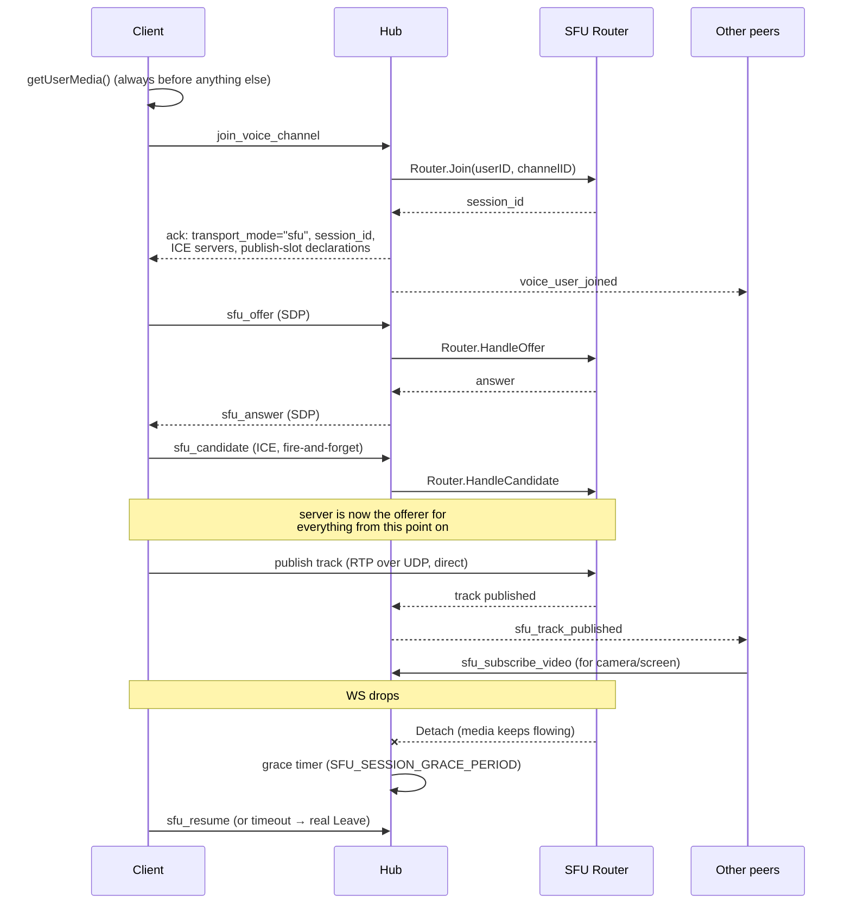

# Voice & video

> Authoritative: `internal/service/sfu/`

Voice and video channels run through a server-side SFU (Selective Forwarding
Unit) built on [Pion](https://github.com/pion/webrtc), embedded in the same
process as the rest of the backend — **not** a peer-to-peer mesh. Every
client publishes to and subscribes through the server; peers never connect
directly to each other.

## Model

`Router` (`internal/service/sfu/router.go`) owns every `Room` (one per voice
channel) and every `Peer` (one per session — one peer joining twice, e.g.
across a reconnect, gets a fresh session, not a shared one).

**One `RTCPeerConnection` per client, with four pre-declared publish slots**
(`PublishSlots` in `router.go`):

| MID | Kind | Source |
|---|---|---|
| `0` | audio | `mic` |
| `1` | video | `camera` |
| `2` | video | `screen` |
| `3` | audio | `screen_audio` |

Because every slot exists from the start, turning a source on/off is always
`sender.replaceTrack()` — never a renegotiation. This also means there's no
glare: after the client's *initial* offer, **the server is always the
offerer** for every subsequent change (a new subscription, a peer joining or
leaving). `Peer` serializes its own work through a command queue
(`peer.enqueue`); the one field read across peers — `published` — is guarded
by `publishedMu`.

Audio is **auto-subscribed** the moment a peer publishes it. Video is not —
a client must send `sfu_subscribe_video` naming which participant's video it
wants, so a large room doesn't force every client to receive every camera.

## Joining a voice channel



Media itself (RTP/RTCP) flows directly between the client and the SFU's UDP
mux — it never touches the Fiber HTTP/WS stack; only signaling does.

## Signaling actions

- **`join_voice_channel`** — no payload; the ack carries `transport_mode:
  "sfu"`, a `session_id`, ICE server URLs/credentials (see
  [`api.md`](api.md) for TURN credential minting), and the publish-slot
  declarations above.
- **`leave_voice_channel`** — tears the session down for real; broadcasts
  `voice_user_left`.
- **`sfu_offer` / `sfu_answer` / `sfu_candidate`** — SDP/ICE exchange with the
  router. `sfu_candidate` is fire-and-forget (no ack expected), which is why
  its failures are reported via the standalone `sfu_error` event instead of
  the normal `error` event (see [`api.md`](api.md)).
- **`sfu_subscribe_video`** — explicit opt-in to receive one participant's
  video (camera or screen). Audio never needs this.
- **`sfu_publish_state`** — a publisher explicitly tells the room when a
  togglable source (`camera` or `screen`) starts/stops actually producing
  media. This exists because fixed publish slots never renegotiate on
  toggle, and the SFU has no reliable way to *infer* "the publisher called
  `replaceTrack(null)`" from RTP alone — there's no spec-guaranteed
  mute/unmute signal on the wire. It's relayed as the same
  `sfu_track_published`/`sfu_track_unpublished` events a first publish uses,
  but it's stateful: the router remembers it (`Peer.setPublishState`) so a
  resumed source gets a fresh keyframe request for its existing subscribers,
  and a late joiner's snapshot (`Peer.sendTrackSnapshot`) doesn't offer a
  source the publisher has explicitly turned off.
- **`sfu_resume`** — reattaches an existing SFU session after a brief
  WebSocket reconnect, without tearing down media (see below).

## Reconnect / grace period

A dropped WebSocket does **not** end a call immediately:

1. `Router.Detach` runs — media keeps flowing, the peer just has no live WS
   to signal over.
2. The hub starts a grace timer (`SFU_SESSION_GRACE_PERIOD`, default `30s`).
3. If the client reconnects and sends `sfu_resume` within the window, the
   session resumes and `voice_user_resumed` is broadcast.
4. If the timer expires first, the hub performs a real `Leave` and broadcasts
   `voice_user_left`.

`voice_user_detached`/`voice_user_resumed` are UI affordances (show the tile
as "reconnecting…"), not membership changes — unlike
`voice_user_joined`/`voice_user_left`, the frontend doesn't treat them as
critical voice events.

## Degradation

If the router fails to construct — most commonly a UDP port already in
use — the error is logged and `sfuRouter` stays `nil`. The rest of the app
is unaffected: chat, REST, everything else keeps working. Only
`join_voice_channel` fails for every user, since there's no router to join.

## `SFU_PUBLIC_IP`

This must be the server's real, publicly reachable IP. If it's wrong or
unset, Pion advertises the container's internal address (e.g. a Docker
bridge IP like `172.x.x.x`) as an ICE host candidate, and ICE never connects
for **anyone** — not just users behind strict NATs. This is the single most
common SFU deployment mistake.

## TURN / coturn

Without TURN, calls work inconsistently depending on the caller's ISP/NAT —
this is exactly the situation where "it works over a VPN" reports come from.

1. Set TURN variables in the deployment environment:

   ```bash
   TURN_REALM=your-domain.com
   TURN_PUBLIC_IP=YOUR_SERVER_PUBLIC_IP
   TURN_USERNAME=mini_discord
   TURN_PASSWORD=strong-turn-password
   TURN_TLS_PORT=5349
   TURN_TLS_CERT_FILE=/etc/coturn/certs/fullchain.pem
   TURN_TLS_KEY_FILE=/etc/coturn/certs/privkey.pem
   TURN_MIN_PORT=49160
   TURN_MAX_PORT=49260

   VITE_WEBRTC_TURN_URLS=turn:your-domain.com:3478?transport=udp,turn:your-domain.com:3478?transport=tcp,turns:your-domain.com:5349?transport=tcp
   VITE_WEBRTC_TURN_USERNAME=mini_discord
   VITE_WEBRTC_TURN_CREDENTIAL=strong-turn-password
   VITE_WEBRTC_FORCE_RELAY=false
   ```

   Leaving `VITE_WEBRTC_TURN_USERNAME`/`VITE_WEBRTC_TURN_CREDENTIAL` **unset**
   is actually the recommended mode: the frontend then calls
   `GET /webrtc/turn-credentials` for short-lived, per-user credentials
   (coturn's `use-auth-secret` scheme) instead of a static, shared one baked
   into the frontend build. Set them explicitly only to force the old
   static-credential mode.

2. Open firewall ports on the host:

   - `3478/tcp`, `3478/udp`
   - `5349/tcp`
   - `49160-49260/udp`, `49160-49260/tcp`

3. Put certificates for coturn at:

   - `deploy/coturn/certs/fullchain.pem`
   - `deploy/coturn/certs/privkey.pem`

For highly restrictive networks (some VPN/corporate/mobile providers), TURN
over UDP can still be blocked. Keep `transport=tcp` in
`VITE_WEBRTC_TURN_URLS` and temporarily set `VITE_WEBRTC_FORCE_RELAY=true` —
this is a **diagnostic** switch that forces the relay path, useful for
confirming TURN itself is healthy before chasing other causes.

Quick check after deploy (logs should show allocations as users join calls):

```bash
docker compose logs -f turn
```

## Diagnostics

`GET /api/v1/admin/sfu/rooms` (HTTP Basic auth, `http_server.user`/`password`)
returns a live JSON snapshot of every room and peer the router currently
knows about. It exists because SFU bugs tend to be silent: the WebRTC
connection looks perfectly healthy, but one specific subscriber just never
receives a track. This endpoint answers "what does the router think is
happening right now" directly, instead of reconstructing it from logs after
the fact.

## Load testing

`cmd/sfuload` is a headless client that drives N real SFU sessions against a
running server, each publishing a looping recording and (by default)
subscribing to every other participant's video. Each simulated bot needs its
**own real user JWT** — an SFU session is tied 1:1 to a `user_id`, and the
server ends a user's existing voice session the instant that same user
"joins" again, so one token can't stand in for multiple bots. See
`go run ./cmd/sfuload -h` for the full flag list.

## Tests

All backend tests currently live in `internal/service/sfu/` (there is no
frontend test runner — see [`frontend.md`](frontend.md)):

| File | Covers |
|---|---|
| `simulcast_test.go` | Simulcast layer selection |
| `track_test.go` | RTP sequence-number rewriting across layer switches |
| `activespeaker_test.go` | Active-speaker detection |
| `publishstate_test.go` | `sfu_publish_state` semantics |
| `smoke_test.go` | Actually binds the UDP mux — a real network-level smoke test, not a pure unit test |

```bash
go test ./internal/service/sfu/...
go test ./internal/service/sfu -run TestForwardToSubscribersSwitchesOnlyOnKeyframe -v   # single test
```

Layer switches (simulcast) only take effect on a keyframe — `simulcast.go`
and `track.go` handle both layer selection and the PLI (keyframe) requests
that make a switch actually visible promptly.
